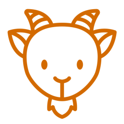

= xygeni-goat - Vulnerable repository against supply chain attacks
:toc:
:toc-title: Contents
:toclevels: 1

image:https://img.shields.io/badge/maintained%20by-xygeni.io-blueviolet[Maintained by xygeni.io,link=https://xygeni.io/?utm_source=github&utm_medium=organic_oss&utm_campaign=xygeni-goat]

A deliberately vulnerable repository against software supply chain attacks, by Xygeni.

== Introduction

Xygeni-goat helps to understand DevOps teams the best practices to follow and which issues should be avoided, for having a good security posture, lowering the risk against software supply chain attacks. Looking at the elements reported as security flaws, you may learn about misconfigurations to avoid. IaC templates that contains insecure configurations, hardcoded secrets, unsafe tool configurations, troublesome dependencies and more are covered.

This repository is based on existing "Goat" projects, like OWASP https://github.com/WebGoat/WebGoat[WebGoat]. 

**Shear the (nefarious) goat !**

*WARNING*: This repository is for educational purposes only. Do NOT attempt to use the techniques and items shown for unauthorized hacking. Do NOT deploy assets from this repository this in any environment.

*DISCLAIMER*: Xygeni-goat comes with no warranties. By using xygeni-goat, you take full responsibility for any outcomes. Xygeni would not be liable of any misuse of the information and assets contained in this repository. 

== Getting Started

=== Clone the repo, or download

----
git clone https://github.com/xygeni/xygeni-goat.git
----
or
----
gh repo clone xygeni/xygeni-goat
----

=== Install the Xygeni scanner

Download the scanner zipfile from https://get.xygeni.io/latest/scanner/xygeni_scanner.zip and unzip it, e.g. in your `$HOME` directory (it will create a `xygeni_scanner` directory).

You may check it against the https://raw.githubusercontent.com/xygeni/xygeni/main/checksum/latest/xygeni-release.zip.sha256[SHA-256 checksum].

You need a personal or organizational https://in.xygeni.io/dashboard/configuration-panel/profile[Xygeni API token]. Set the `XYGENI_TOKEN` environment variable with the token (`export XYGENI_TOKEN=...` in Linux/macOS, or `set XYGENI_TOKEN ...` plus `setx XYGENI_TOKEN ...` in Windows).

TIP: You may also set an alias to the xygeni script.

For full details, read https://docs.xygeni.io/getting-started/quick-start-with-xygeni-cli[Quick start with Xygeni CLI].

=== Run the scanner on xygeni-goat

Run the `scan` command over the contents in the `xygeni-goat/source` directory, or any subdirectory beneath for a partial analysis.

Under Linux / macOS:
[source,shell]
----
cd xygeni-goat/source
"$HOME/xygeni_scanner/xygeni" scan
----

Under Windows (Powershell):

[source,powershell]
----
cd xygeni-goat/source
"$HOME\xygeni_scanner\xygeni.ps1" scan
----

Open the referenced link to see the findings in the Xygeni dashboard !

To use other scan commands, follow the instructions in the https://docs.xygeni.io/xygeni-scanner-cli/xygeni-cli-overview[Xygeni CLI Overview].

== Contributing

You may add your own vulnerable items to help others learn about additional security issues, and raise awareness on new potential attacks.
We recommend you to keep the existing directory structure for better categorizing those security issues. Pull Requests are welcomed !

In addition, if you want to add a new "capture the flag" (CTF) check, you are welcome!

=== Development

. Clone the repository:
+
----
git clone https://github.com/xygeni/xygeni-goat.git
----
+
or
+
----
gh repo clone xygeni/xygeni-goat
----
+
Alternatively, you may https://docs.github.com/en/get-started/quickstart/fork-a-repo[fork the repo].

. Create your topic branch

. Develop your changes
+
We recommend to follow the existing directory structure for categorizing the security issue. 

. Test your changes
+
If you developed a new check, test with [TBD].
+
If you created a new vulnerable element, test it with Xygeni scanner, as shown in the <<Getting Started,Getting Started>> section.

. Push commits to your topic branch.

. Create a pull request, using `gh pr create` command or the GitHub desktop / web UI.
+
After review, your PR will be merged.

=== Add a new Capture The Flag challenge

#[TBD]#

Each CTF challenge has a separate directory in the `ctf` directory.
Follow the steps below to add a CTF challenge: 

. Write challenge description.
. Choose category and difficulty level.
. Write hints for help.
. Add a flag. Ensure that it is not accesible when solving other CTF challenges.
. Write tests.
. Write the solution.
. Create a README.md in your CTF directory.

== Support

#[TBD]#
